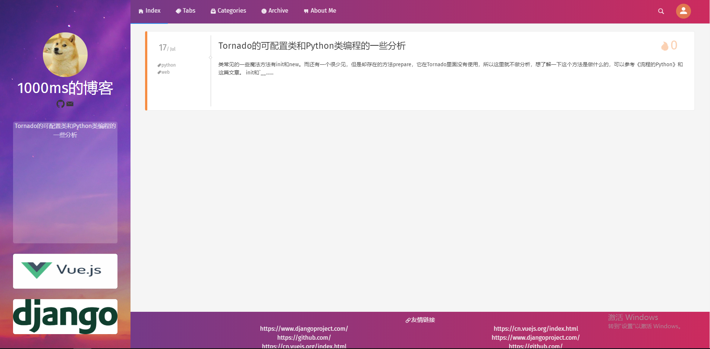

# 基于django和Vue的demo项目：个人Blog

项目展示地址：[blog.tot.moe](http://blog.tot.moe) （小水管服务器，首次打开会比较慢......）

项目说明

1. 项目使用前后端分离：前端使用Vue全家桶；后端django+Django REST framework
2. 使用MySQL数据库进行数据的存储；使用Redis数据库提供缓存支持和Celery的任务队列；使用elasticsearch数据库提供全文搜索的支持
3. 使用docker compose方便的进行部署和开发；使用nginx进行内部的反向代理，分离静态文件请求和api请求；使用gunicorn作为django对接的WSGI服务器，提供更好的性能和异步IO的支持；内含Jenkinsfile提供CD支持
4. 后端实现了完整的blog功能逻辑：完整的blog及相关内容增删改查功能；动态的管理网站的logo等信息；网站的整体状况统计（每日的访客，点赞，评论数，以及访客所在地址）；demo模式：方便直接浏览后台却没有修改权限；使用缓存降低MySQL数据库的访问次数并提高访问效率；Celery异步任务：将ip地址查询和统计信息任务分离出去不影响访问效率；完整的单元测试确保代码可靠
5. 美观好用的前端：使用vue-cli构筑的Vue作为前端框架；iView作为主要UI库；vue-router作为SPA的路由控制器；Vuex进行前端全局的数据管理；Echart提供前端图表化展示数据；可以支持不同设备的页面自适配
6. 本地内置[ip2region](https://github.com/lionsoul2014/ip2region)数据库直接查询ip来源地址，节省网络资源。使用Baidu Map的Api进行地址和经纬度的对应，以及配合Inmap进行前端的可视化来源地图的展示

## 图片
1. 前台



2. 后台


### 部分功能展示
1. 发表文章


2. 发表评论


3. 前端效果


4. 页面自适配


### 使用demo登录
1. 点击右上角头像


2.选择登录，之后点击demo模式登录


3. 登录成功后右上角进入管理中心


## 文件说明
- backend :后端代码
- docker-compose-file :docker compose需要用到的一些文件
- elasticsearch :docker compose构筑elasticsearch用到的文件，包含的换源；更换市区；安装中文分词支持
- front_end :前端代码
- README :本说明用到的一些图片
- static :静态文件，会作为volume挂着到docker中的nginx里面
- volumn :通用的volume，会挂载到docker中相应的容器里面
- docker-compose-dev.yml :开发使用的docker compose file
- docker-compose-test.yml :测试使用的docker compose file，包含flake8测试和覆盖率测试

## 运行说明

1. 先在本地部署docker compose
3. 添加后端secret文件（见本文后面的说明）
2. 运行
```
docker-compose -f docker-compose.yml -f docker-compose-file/run.yml up
```


### 项目其他信息

#### 返回码定义

1. 200：成功
2. 400：错误请求（错误参数等）
3. 403：没有对应请求权限
4. 404：未找到对应请求资源
5. 500：服务器内部错误

其他错误码参考django rest framework的错误码：[官方文档地址](https://www.django-rest-framework.org/api-guide/status-codes/)

#### 后端model防止错误的循环引用

1. model类的ForeignKey内的使用字符串
2. manager类不要引用model类，要使用自身model类的relation field的model的时候，使用self.model.{{relation field}}.field.remote_field.model获得对应model类

#### mysql数据库

建表语句
```
CREATE DATABASE  `my_blog` DEFAULT CHARACTER SET utf8mb4 COLLATE utf8mb4_unicode_ci;
```

#### 百度地图AK
直接百度地图开发者中心注册帐号，创建应用即可获得AK

#### 后端secret文件
后端机密信息信息存放在后端根目录下的`secret.py`文件里，这个文件不会被git同步，需要自行添加。

机密信息内容包括：
```
# django秘钥
SECRET_KEY = 

# 数据库用户及密码
DATABASE_ACCOUNT = 
DATABASE_PASSWORD = 

# 百度AK密匙，用于获取IP的经纬度
BAIDU_AK = 
```

#### ip与位置
1. ~~ip搜索比较消耗时间，所以可以选择关闭~~ 已使用celery改为异步处理
2. ip对应地址使用本地搜索，提高效率
3. 城市经纬度使用baidu map的api进行，获取匹配前端百度地图的结果
4. 使用异步任务拆分这部分功能

#### 前端secret文件
后端机密信息信息存放在后端根目录下的`secret.py`文件里，这个文件不会被git同步，需要自行添加。

```
export default {
	// 百度地图ak
    baiduMapAK: 
}
```
